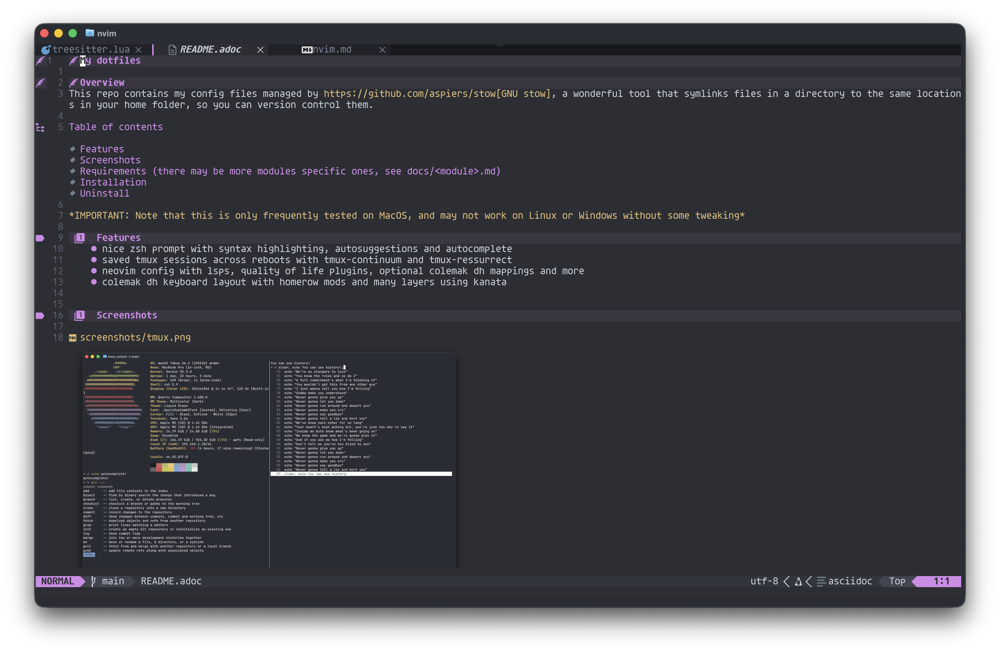
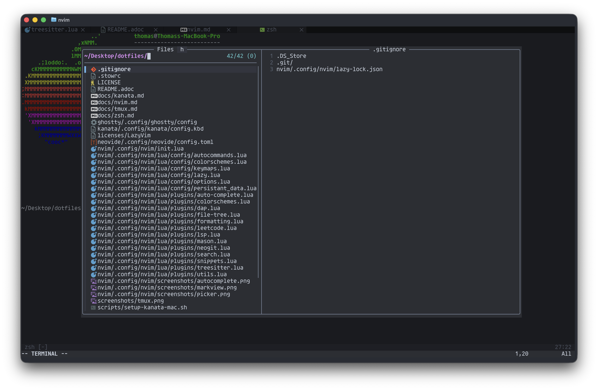

= My dotfiles

:toc:

*IMPORTANT: Note that this is only frequently tested on MacOS, and may not work on Linux or Windows without some tweaking*

== Features
- nice zsh prompt with syntax highlighting, autosuggestions and autocomplete
- saved tmux sessions across reboots with tmux-continuum and tmux-ressurrect
- neovim config with lsps, quality of life plugins, optional colemak dh mappings and more
- colemak dh keyboard layout with homerow mods and many layers using kanata
- multiple config modules that can be install/uninstalled independantly

== Screenshots

image::screenshots/tmux.png[tmux]

== Installation

First clone this repo.

[source,sh]
----
git clone https://github.com/thomasfarci/dotfiles
cd dotfiles
----

This repositorie contains many modules (folders) that can be installed by running:
[source,sh]
----
scripts/install <module>
----

For further instructions, see `docs/<module>.adoc`.

== Uninstall
[source,sh]
----
scripts/uninstall <module>
----
