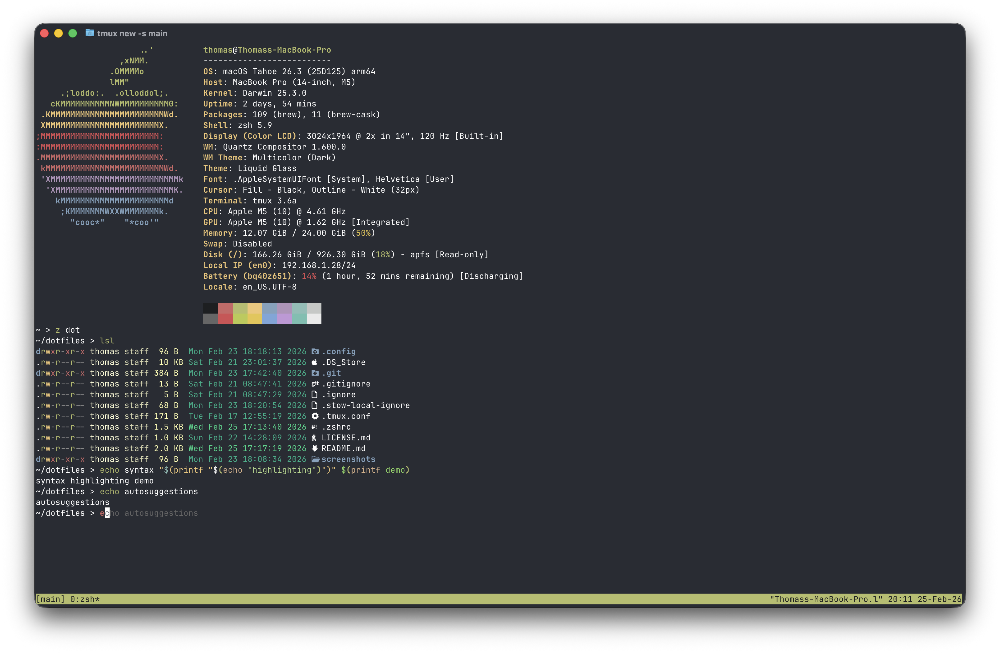
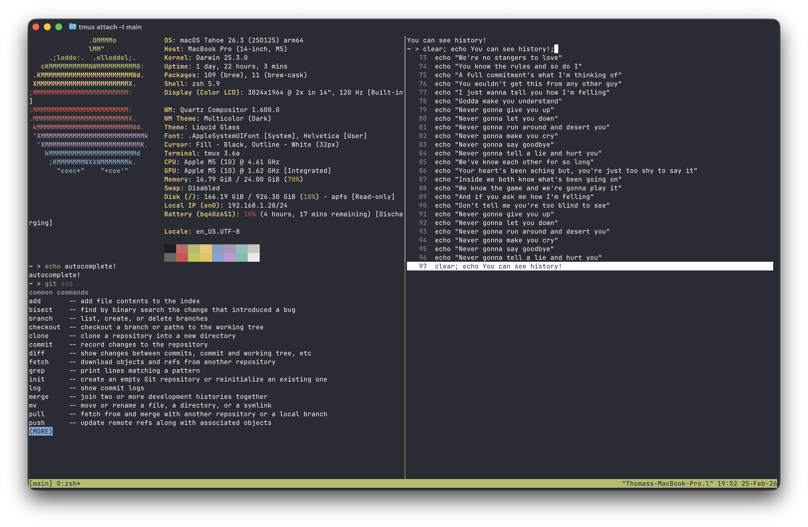

# My dotfiles

## Overview
This repo contains my config files managed by [GNU stow](https://github.com/aspiers/stow/), a wonderful tool that symlinks files in a directory to the same locations in your home folder, so you can version control them.

**IMPORTANT: Note that this is only frequently tested on MacOS, and may not work on Linux or Windows without some tweaking**

## Features
- nice zsh prompt with syntax highlighting, autosuggestions and autocomplete
- saved tmux sessions across reboots with tmux-continuum and tmux-ressurrect
- neovim config with lsps, quality of life plugins, optional colemak dh mappings and more
- colemak dh keyboard layout with homerow mods and many layers using kanata


## Screenshots





## Requirements (there may be more modules specific ones, see docs/<module>.md)
- git
- stow

## Installation

First clone this repo.
```sh 
git clone https://thomasfarci/dotfiles
cd dotfiles
```

This repositorie contains many modules (folders) that can be installed by running:
```sh
scripts/setup.sh <module>
```

You can see modules specific notes in docs/<module>.md

When you run this stow command, it symlinks the files in the <module> directory to the corresponding location in the home folder. 
For example, if you have `example/foo/bar` and you run stow example, it will link bar to `$HOME/foo/bar`. 
If `$HOME/foo/bar` already existed, it will give an error. 
This means that if you already have some config files that are also here, you will need to make backups. For example for zsh:
```sh
mv ~/.zshrc ~/.zshrc.bak
mv ~/.zshenv ~/.zshenv.bak
cd path/to/cloned/dotfiles
stow zsh
```
Note that by default, it links to the parent directory from which stow was run, so not nessarily `$HOME`, but here I privided the file [.stowrc](.stowrc) which sets an option to make it the always home folder. 


## Uninstall
```sh
stow -D <module>
```
There may be additional stuff to do, see docs/<module>.md
